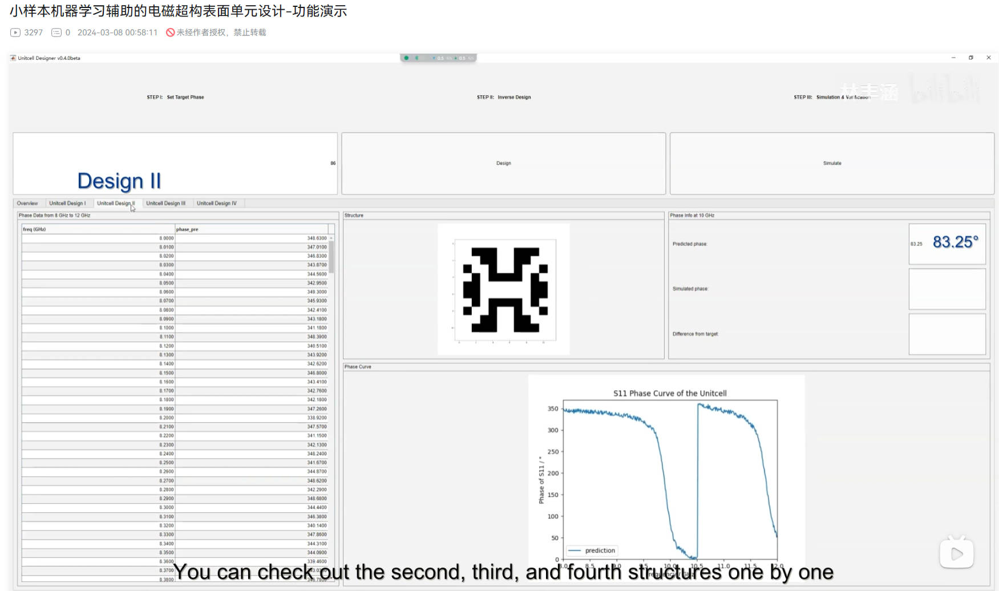
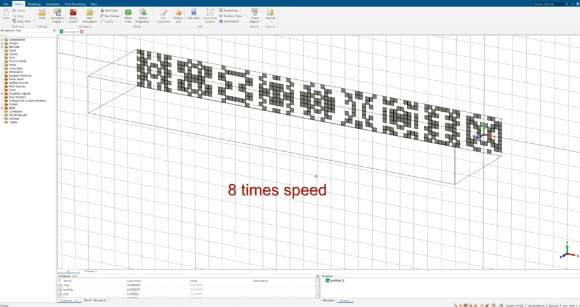

# Inverse-Design-of-Patch-Antennas

This repository hosts a **simple demonstration** of a deep learning approach for the inverse design of patch antennas. The goal is to explore energy-efficient designs and to significantly reduce simulation cost compared to conventional methods. 

The following papers have been published in relation to this repository:
1. [Inverse Design of Reflective Metasurface Antennas Using Deep Learning from Small-Scale Statistically Random Pico-Cells](https://onlinelibrary.wiley.com/doi/full/10.1002/mop.34068)

2. [Energy Efficient Design of Low-Profile Wideband Microstrip Patch Antennas Using Deep Learning](https://ieeexplore.ieee.org/document/10276793)

Additionally, we have another video that demonstrates the **inverse design of reflective metasurfaces**. You can watch it [here](https://www.bilibili.com/video/BV1Bx4y1D7LF/?spm_id_from=333.999.0.0&vd_source=07c2e4f919ec533eb2ddf652d4ab4c9b).



## Update - September 6, 2024
We have design a GUI video that demonstrates the **Fast Design of Multi-Beam Metasurface Antennas**. You can watch it [here](https://www.bilibili.com/video/BV1DbHDerEY6/?spm_id_from=333.999.0.0).



## Update - April 15, 2024
The information about the Python version, interpretation of the prediction results, and the simulation validation section can be found in the issues.

## Update - April 11, 2024
The reference design for this project is from Professor K. L. Wong's book ["Compact and Broadband Microstrip Antennas"](https://onlinelibrary.wiley.com/doi/book/10.1002/0471221112), page 237, featuring a U-slot patch antenna, as shown below for reference.


## Update - April 9, 2024
### Code Annotations
Necessary comments have been added to the code.

### Training and Prediction Configuration
To configure training and prediction for CPU or GPU, modify line 19 in `train.py` and `predict.py`:
   - `os.environ["CUDA_VISIBLE_DEVICES"] = "-1"` for CPU-based training and prediction.
   - `os.environ["CUDA_VISIBLE_DEVICES"] = "0"` for GPU-based training and prediction. (Requires additional installation of CUDA and cuDNN.)

### CPU Usage Tips
When using CPU, adjust the `count` value at line 168 in `predict.py` to control the frequency of saving predictions (dictated by available memory). The total number of prediction samples is approximately 2 million.

### GPU Usage Tips
For GPU usage, employ `predict-gpu.py` to significantly enhance the prediction output rate, offering a 500x speedup compared to the CPU version.

## Update - April 8, 2024

### Dependencies Update
The `requirements.txt` file has been updated to include only four essential libraries for this project:

- matplotlib==3.8.4
- numpy==1.26.4
- tensorflow-gpu==2.10.0
- scipy==1.13.0

### CPU Training Compatibility
To ensure wider accessibility, the `train.py` and `predict.py` scripts have been updated to support training using only the CPU. This change allows users without a GPU to run the training and prediction processes. The code now defaults to CPU training, making it convenient for users who prefer or need to use CPU resources.

Please note that while `tensorflow-gpu` is still listed as a requirement, the updated code will gracefully fallback to CPU training if a GPU is not available.

## Overview

This repository presents a novel inverse design methodology for patch antennas using deep learning techniques. The project encompasses several key components:

- **Data Generation**: Generation of a comprehensive dataset for training the deep learning model.
- **Data Preprocessing**: Preprocessing of the dataset to ensure high-quality input for the network.
- **Network Training & Testing**: Implementation and training of the deep learning model, followed by rigorous testing to validate its performance.
- **Prediction**: Utilization of the trained model to predict optimal patch antenna designs.
- **Inverse Design**: Process of designing patch antennas based on the predictions from the deep learning model.

## Getting Started
The version of python is 3.9.18. 

**The detailed steps for the environmental configuration will be updated soon. Please stay tuned for the latest information.**

To get started with this simple demonstration of inverse design for patch antennas, follow these steps:

1. **Clone the Repository**
   Clone this repository to your local machine using the following command:
   ```bash
   git clone https://github.com/youxch/Inverse-Design-of-Patch-Antennas.git
2. **Install Dependencies**
   Install all necessary dependencies by running:
   ```bash
   pip install -r requirements.txt
3. **Data Preparation**
   The training dataset is prepared through automated simulations controlled by code, resulting in the `train_data.txt` file which is properly formatted with the structural parameters and simulation results for patch antennas.
4. **Model Training**
   Run the `train.py` script to preprocess the training data and train the Multilayer Perceptron (MLP) network:
   ```bash
   python train.py
   ```
   The trained model weights will be saved as `saved-model-5000.h5`, with ‘5000’ indicating the number of iterations or a training metric.
   
   
6. **Model Prediction and Inverse Design**
   Use the `predict.py` script to make predictions and perform inverse design.
   ```bash
   python predict.py
   ```
   or
    ```bash
   python predict-gpu.py
   ```
   Ensure that the trained model weights file saved-model-5000.h5 is available before running predictions.

## Contact

For any questions or suggestions, please open an issue or directly contact the maintainers.

## License

This project is licensed under the MIT License - see the [LICENSE.md](LICENSE.md) file for details.

## Cite
If you use the code provided in this repository, please cite the following papers:

1. You, X. C., & Lin, F. H. (2024). Inverse Design of Reflective Metasurface Antennas Using Deep Learning from Small-Scale Statistically Random Pico-Cells. Microwave and Optical Technology Letters, 2024, 66(2), e34068.

2. You, X. C., & Lin, F. H. (2023). Energy Efficient Design of Low-Profile Wideband Microstrip Patch Antennas Using Deep Learning. In 2023 International Conference on Microwave and Millimeter Wave Technology (ICMMT), Qingdao, China, 2023, pp. 1-3. 

Thank you for your cooperation in acknowledging the original work.

