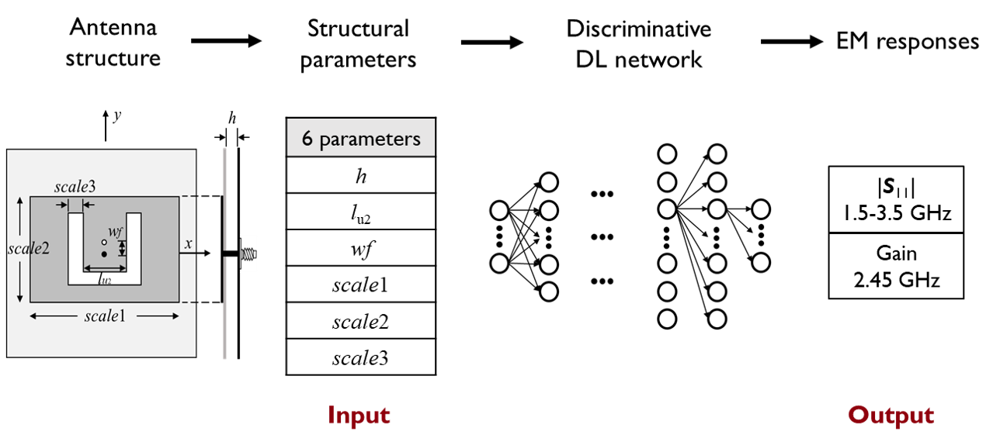

# Inverse-Design-of-Patch-Antennas

This repository hosts a **simple demonstration** of a deep learning approach for the inverse design of patch antennas. The goal is to explore energy-efficient designs and to significantly reduce simulation costs compared to conventional methods. 


## Overview

This repository presents a novel inverse design methodology for patch antennas using deep learning techniques. The project encompasses several key components:

- **Data Generation**: Generation of a comprehensive dataset for training the deep learning model.
- **Data Preprocessing**: Preprocessing of the dataset to ensure high-quality input for the network.
- **Network Training & Testing**: Implementation and training of the deep learning model, followed by rigorous testing to validate its performance.
- **Prediction**: Utilization of the trained model to predict optimal patch antenna designs.
- **Inverse Design**: Process of designing patch antennas based on the predictions from the deep learning model.

## Getting Started

To get started with this simple demonstration of inverse design for patch antennas, follow these steps:

1. **Clone the Repository**
   Clone this repository to your local machine using the following command:
   ```bash
   git clone https://github.com/username/Inverse-Design-of-Patch-Antennas.git
2. **Install Dependencies**
   Install all necessary dependencies by running:
   ```bash
   pip install -r requirements.txt
3. **Data Preparation**
   The training dataset is prepared through automated simulations controlled by code, resulting in the `train_data.txt` file which is properly formatted with the structural parameters and simulation results for patch antennas.
4. **Model Training**
   Run the `train.py` script to preprocess the training data and train the Multilayer Perceptron (MLP) network:
   ```bash
   python train.py
   ```
   The trained model weights will be saved as `saved-model-5000.h5`, with ‘5000’ indicating the number of iterations or a training metric.
5. **Model Prediction and Inverse Design**
   Use the `predict.py` script to make predictions and perform inverse design.
   ```bash
   python predict.py
   ```
   Ensure that the trained model weights file saved-model-5000.h5 is available before running predictions.

## Contact

For any questions or suggestions, please open an issue or directly contact the maintainers.

## License

This project is licensed under the MIT License - see the [LICENSE.md](LICENSE.md) file for details.

## Cite
If you use the code provided in this repository, please cite the following papers:

1. You, X. C., & Lin, F. H. (2023). Energy Efficient Design of Low-Profile Wideband Microstrip Patch Antennas Using Deep Learning. In 2023 International Conference on Microwave and Millimeter Wave Technology (ICMMT), Qingdao, China, 2023, pp. 1-3. [DOI: 10.1109/ICMMT58241.2023.10276793](https://doi.org/10.1109/ICMMT58241.2023.10276793)

2. You, X. C., & Lin, F. H. (2024). Inverse design of reflective metasurface antennas using deep learning from small-scale statistically random pico-cells. Microwave and Optical Technology Letters, 2024, 66(2), e34068.

Thank you for your cooperation in acknowledging the original work.

